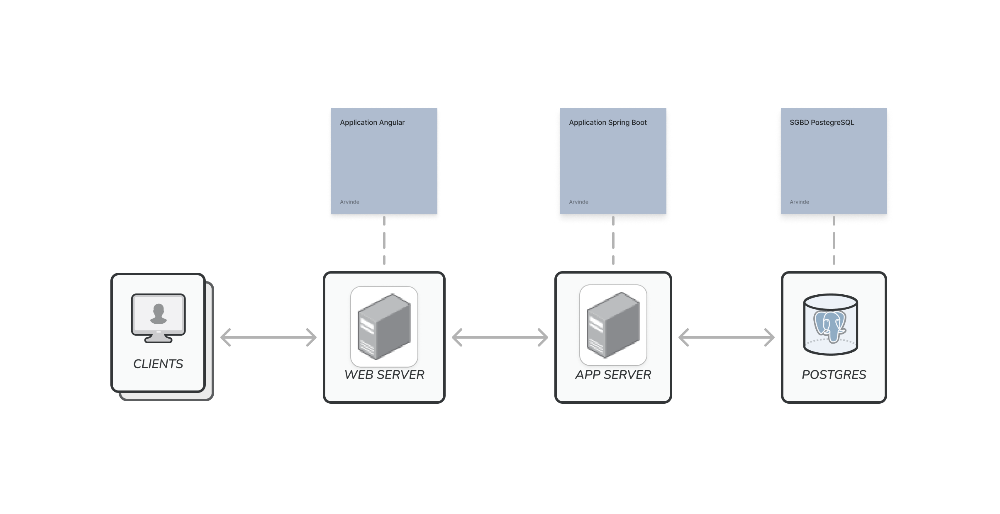
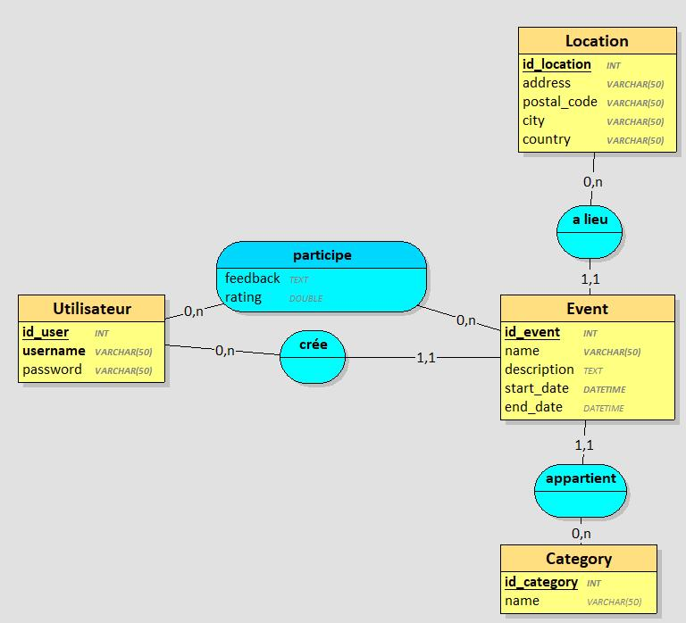
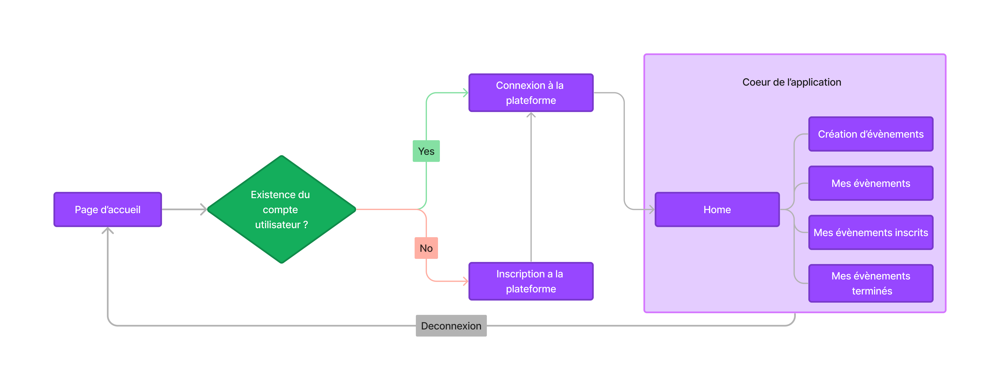
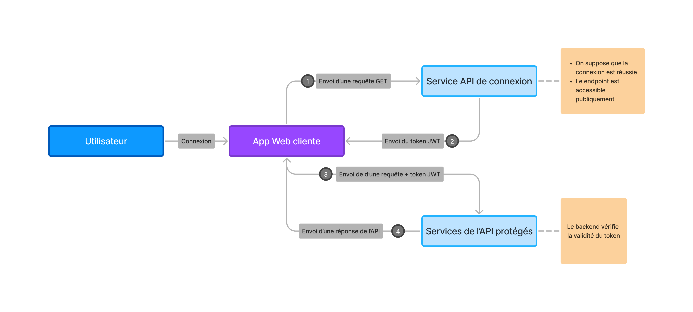

# 🏴‍☠️ Pirat'events — Backend

Backend API for the **Pirat'events** web application.

Pirat'events is an event management platform designed to allow users to create, manage, and participate in events. The application provides features for event creation, user authentication, feedback, and event exploration.

This backend provides a **REST API built with Spring Boot** and handles authentication, business logic, and database interaction.

Frontend repository:
https://github.com/Arvindesss/event-management-frontend

---

# 🚀 Features

The backend supports the following functionalities:

- Create new events
- Update and delete existing events
- User registration and authentication
- Browse events using different views:
  - Home (explore events)
  - My events
  - Events I joined
  - Past events
- Search and filter events by:
  - Name
  - Category
  - Location
- Leave feedback and ratings for finished events
- View feedback and ratings from other users

---

# 🧰 Technologies

- Java
- Spring Boot
- Spring Security
- JWT Authentication
- PostgreSQL
- Maven
- Neon (PostgreSQL hosting)

The backend also integrates **JWT authentication** to secure API endpoints.

---

# 🏗️ Backend Architecture

The backend follows a classic **Spring Boot layered architecture**:
- Controller
- Service
- Repository
- Model
  
An additional **auth package** is used to isolate authentication logic from the rest of the application.

---

# 🗄️ Database

The application uses **PostgreSQL** as its database.

The SQL file used to create the database schema is available in: src/main/resources

# 🔐 Authentication Flow

The API uses **JWT (JSON Web Token)** for authentication.

Process:

1. The user sends login credentials.
2. The backend validates the credentials.
3. A JWT token is returned.
4. The client includes the token in future API requests.
5. The backend verifies the token before allowing access to protected endpoints.

---

## 📊 Diagrams

The following diagrams illustrate the architecture and design of the Pirat'events application.

Note: the diagrams are in **French** as they come from the original university project documentation.

### Application Architecture

### Database Conceptual Model

### Navigation Diagram

### JWT Authentication Flow

